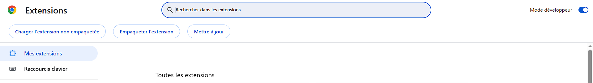
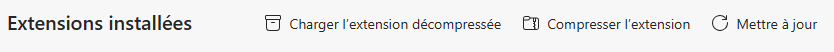
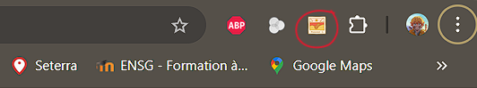

Peacnut 🥜
===========

[](https://github.com/Australes-Inc/Peacnut)

---

**⚠️ CE DÉPÔT N'EST PLUS MAINTENU ⚠️**

Ce projet a été migré vers un nouveau dépôt GitHub. Toutes les futures mises à jour, corrections de bugs et contributions se feront sur le nouveau dépôt.

Veuillez vous référer au nouveau dépôt pour la dernière version du code :
➡️ **[Australes - Peacnut](https://github.com/Australes-Inc/Peacnut)**

---


> Version: 1.0.2

## Comment l'utiliser sur sa machine

Pour publier des extensions sur _Chrome Web Store_, il faut payer 5$, c'est pourquoi je vous propose de passer par ce git pour accéder à l'extension.

Dans votre terminal ou directement dans VS Code clonez le git:

```
/* Dans le terminal */
git clone https://github.com/diegoposba/Peacnut.git

/* Dans VS Code */
Crtl + Shift + G
Cliquez sur Clone Repository 
Entrez: https://github.com/diegoposba/Peacnut.git
```

## Ajouter l'extension à Chrome (ou Edge)

Ouvrez Chrome et entrez cette URL: [chrome://extensions](chrome://extensions/)(pour Edge: [edge://extensions](edge://extensions/)).

Une fois sur cette page activez le **_Mode développeur_** en haut à droite sur Chrome (dans le menu à gauche sur Edge). Normalement une navbar est apparue:

Chrome: 


Edge:


Maintenant cliquez sur _Charger l'extension non empaquetée_ (respectivement _Charger l'extension décompressée_), votre explorateur de fichiers devrait s'ouvrir. 

Allez chercher le dossier **Peacnut** et cliquez sur _Sélectionner un fichier_.

C'est bon, vous avez ajouté l'extension à votre navigateur. N'hésitez pas à l'épingler dans la zone des extensions de votre navigateur:



Maintenant en cliquant sur l'extension, vous pourrez extraire des images depuis n'importe quelle page web !

## Licence

Peacnut est sous licence MIT ([MIT-LICENSE](./LICENSE) ou [https://opensource.org/license/MIT](https://opensource.org/license/MIT)).
